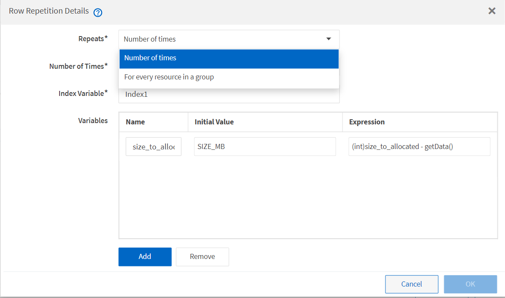

= Fonctionnement de la répétition de la ligne
:allow-uri-read: 
:icons: font
:imagesdir: ../media/

[role="lead"]
Un flux de travail contient des commandes et des détails de commande disposés en lignes. Vous pouvez spécifier les commandes d'une ligne à répéter pour un nombre fixe d'itérations ou un nombre dynamique d'itérations basé sur les résultats des critères de recherche.

Les détails de la commande dans une ligne peuvent être spécifiés pour répéter un certain nombre de fois ou lorsque le flux de travail est conçu. Le flux de travail peut également être conçu de sorte que le nombre de répétitions de la ligne puisse être spécifié lorsque le flux de travail est exécuté ou planifié pour une exécution. Vous pouvez spécifier des critères de recherche pour un objet et les commandes d'une ligne peuvent être définies pour répéter autant de fois que les objets sont renvoyés par les critères de recherche. Les rangées peuvent également être réglées pour être répétées lorsque certaines conditions sont remplies.

== Variables de répétition de ligne

Vous pouvez spécifier des variables dans la liste des variables qui peuvent être manipulées pendant les itérations de ligne. Pour les variables, vous pouvez spécifier un nom, une valeur avec laquelle les variables sont initialisées et une expression MVFLEX expression Language (MVEL) évaluée après chaque itération de la répétition de ligne.

L'illustration suivante montre les options de répétition de ligne et un exemple de variable de répétition de ligne :

== Répétition de ligne avec points d'approbation

Lorsque vous avez spécifié des itérations de lignes répétées pour les commandes et inclus des points d'approbation, toutes les itérations des commandes avant l'exécution d'un point d'approbation. Après avoir approuvé le point d'approbation, l'exécution de toutes les itérations des commandes successives se poursuit jusqu'au point d'approbation suivant.

L'illustration suivante montre comment les itérations de lignes répétées sont exécutées lorsqu'un point d'approbation est inclus dans un flux de travail :

image::../media/approval_repetition.png[répétition de l'approbation]

== Répéter les exemples de lignes dans les flux de travail prédéfinis

Vous pouvez ouvrir les flux de travail prédéfinis suivants dans le concepteur pour comprendre comment les lignes répétées sont utilisées :

* Créez un volume NFS Data ONTAP en cluster
* Créer un datastore VMware NFS sur un système de stockage Data ONTAP en cluster
* Mettre en place le peering de cluster
* Supprimer un volume clustered Data ONTAP

