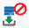

= Fenêtre dictionnaire
:allow-uri-read: 
:icons: font
:imagesdir: ../media/

[role="lead"]
La fenêtre Dictionnaire affiche les entrées de dictionnaire disponibles par ordre alphabétique.

Une entrée de dictionnaire est la définition d'un type d'objet pris en charge par OnCommand Workflow Automation (WFA). Chaque entrée de dictionnaire représente un type d'objet et ses relations dans les environnements de stockage et de stockage. Les entrées de dictionnaire sont converties en tables dans les bases de données.

NOTE: En fonction de votre rôle et de vos privilèges de compte, il se peut que cette fenêtre ne s'affiche pas.

== Table de dictionnaire

Le tableau Dictionnaire répertorie les entrées de dictionnaire disponibles. Chaque entrée est identifiée comme l'une des suivantes :

* image:../media/community_certification.gif[""] - contenu créé par les utilisateurs
* image:../media/ps_certified_icon_wfa.gif[""] - Contenu développé par les Services professionnels (PS), qui n'est disponible que sur des installations personnalisées réalisées par les Services professionnels
* image:../media/community_certification.gif[""] - packs développés par les utilisateurs
* image:../media/lock_icon_wfa.gif[""] - contenu créé par les utilisateurs verrouillés
* image:../media/netapp_certified.gif[""] - Contenu certifié NetApp

Vous pouvez personnaliser l'affichage du tableau à l'aide des fonctions de filtrage et de tri disponibles pour chaque colonne, ainsi qu'en réorganisant l'ordre des colonnes.

* image:../media/filter_icon_wfa.gif["Icône de filtre"] active ou désactive le filtrage pour l'ensemble de la table. Un "x" rouge apparaît sur l'icône si le filtrage est désactivé.
* Double-cliquer image:../media/filter_icon_wfa.gif["Icône de filtre"] efface et réinitialise les sélections de filtrage.
* image:../media/wfa_filter_icon.gif["Icône de filtre"] sur chaque en-tête de colonne, vous pouvez effectuer un filtrage en fonction du contenu des colonnes. Cliquez sur image:../media/wfa_filter_icon.gif["Icône de filtre"] dans une colonne, vous pouvez filtrer un élément spécifique dans la liste déroulante ou sur tous les éléments disponibles.
* Cliquer sur l'en-tête de colonne permet de basculer entre l'ordre croissant et décroissant de tri. Vous pouvez identifier l'ordre de tri appliqué à l'aide des flèches de tri (image:../media/wfa_sortarrow_up_icon.gif["Icône de tri"] pour les valeurs ascendantes et image:../media/wfa_sortarrow_down_icon.gif["Icône de tri"] pour décroissant).
* Pour réorganiser l'emplacement des colonnes, vous pouvez faire glisser et déposer les colonnes dans l'ordre voulu. Toutefois, vous ne pouvez pas masquer ou supprimer ces colonnes.
* Cliquez sur la zone de texte filtre *Search* pour rechercher un contenu spécifique. En outre, vous pouvez effectuer une recherche à l'aide des opérateurs pris en charge pour le type de colonne applicable, alphabétique ou numérique.

La table Dictionnaire contient les colonnes suivantes :

* *Certification*
+
Indique si l'entrée du dictionnaire est créée par l'utilisateur (image:../media/community_certification.gif[""]), PS (image:../media/ps_certified_icon_wfa.gif[""]), communauté (image:../media/community_certification.gif[""]), verrouillé par l'utilisateur (image:../media/lock_icon_wfa.gif[""]) Ou certifié NetApp (image:../media/netapp_certified.gif[""]).

* *Nom*
+
Affiche le nom de l'entrée du dictionnaire.

* *Schéma*
+
Affiche le schéma associé aux entrées du dictionnaire. Un schéma est un ensemble d'entrées de dictionnaire contenant des données pertinentes pour votre environnement. (Par exemple, un schéma vc contient les données pertinentes pour votre environnement virtuel, telles que des machines virtuelles, des hôtes et des datastores.)

* *Version entité*
+
Affiche le numéro de version de l'objet dans `major.minor.revision` format--par exemple, 1.0.0.

* *Description*
+
Affiche la description de l'entrée du dictionnaire.

* *Acquisition activée*
+
Affiche une coche pour les entrées de dictionnaire activées pour l'acquisition de données.

* *Dernière mise à jour*
+
Affiche la date et l'heure de la dernière mise à jour de l'entrée du dictionnaire.

* *Mis à jour par*
+
Affiche le nom de l'utilisateur qui a mis à jour l'entrée du dictionnaire.

* *Verrouillé par*
+
Affiche le nom de l'utilisateur qui a verrouillé l'entrée du dictionnaire.

* *Touches naturelles*
+
Affiche les clés naturelles associées aux entrées du dictionnaire.

== Barre d'outils

La barre d'outils se trouve au-dessus de l'en-tête de colonne. Vous pouvez utiliser les icônes de la barre d'outils pour effectuer diverses actions. Vous pouvez également accéder à ces actions à partir du menu contextuel de la fenêtre.

* *image:../media/new_wfa_icon.gif["Nouvelle icône"] (Nouveau)*
+
Ouvre la fenêtre New Dictionary Entry, qui permet de créer une nouvelle entrée de dictionnaire.

* *image:../media/edit_wfa_icon.gif["Icône Modifier"] (Modifier)*
+
Ouvre la fenêtre entrée dictionnaire <Nom_entrée> pour l'entrée de dictionnaire sélectionnée, qui vous permet de modifier l'entrée de dictionnaire.

* *image:../media/clone_wfa_icon.gif["Icône cloner"] (Clone)*
+
Ouvre la fenêtre Nouvelle entrée de dictionnaire <Nom_entrée>_copie, qui vous permet de créer une copie de l'entrée de dictionnaire sélectionnée.

* *image:../media/lock_wfa_icon.gif["Icône de verrouillage"] (Verrouillage)*
+
Ouvre la boîte de dialogue Verrouiller la confirmation de l'entrée du dictionnaire, qui vous permet de verrouiller l'entrée du dictionnaire sélectionnée.

+
Cette option n'est activée que pour les entrées de dictionnaire que vous avez créées.

* *image:../media/unlock_wfa_icon.gif["Icône de déverrouillage"] (Déverrouiller)*
+
Ouvre la boîte de dialogue déverrouiller la confirmation de l'entrée du dictionnaire, qui vous permet de déverrouiller l'entrée du dictionnaire sélectionnée.

+
Cette option n'est activée que pour les entrées de dictionnaire que vous avez verrouillées. Les administrateurs peuvent déverrouiller des entrées de dictionnaire verrouillées par d'autres utilisateurs.

* *image:../media/delete_wfa_icon.gif["Icône Supprimer"] (Supprimer)*
+
Ouvre la boîte de dialogue de confirmation de suppression d'une entrée de dictionnaire, qui permet de supprimer l'entrée de dictionnaire créée par l'utilisateur sélectionnée.

+

NOTE: Vous ne pouvez pas supprimer une entrée de dictionnaire WFA ou une entrée de dictionnaire PS.

* *image:../media/export_wfa_icon.gif["Icône Exporter"] (Exportation)*
+
Permet d'exporter l'entrée de dictionnaire créée par l'utilisateur sélectionnée.

+

NOTE: Vous ne pouvez pas exporter une entrée de dictionnaire WFA ou une entrée de dictionnaire PS.

* *image:../media/enable_acquisition_wfa_icon.gif["Activer l'icône d'acquisition"] (Activer l'acquisition)*
+
Permet d'activer l'acquisition de cache pour l'entrée de dictionnaire sélectionnée.

* * (Désactiver l'acquisition)*
+
Vous permet de désactiver l'acquisition du cache pour l'entrée du dictionnaire sélectionnée.

* *image:../media/reset_scheme_wfa_icon.gif["Icône de réinitialisation du schéma"] (Schéma de réinitialisation)*
+
Permet de réinitialiser le schéma associé à l'entrée du dictionnaire sélectionnée.

* *image:../media/add_to_pack.png["icône ajouter au pack"] (Ajouter au pack)*
+
Ouvre la boîte de dialogue Ajouter au dictionnaire de composition à emporter, qui permet d'ajouter l'entrée du dictionnaire et ses entités fiables à un pack, modifiable.

+

NOTE: La fonction Ajouter au pack n'est activée que pour les entrées de dictionnaire pour lesquelles la certification est définie sur *aucun.*

* *image:../media/remove_from_pack.png["icône supprimer du pack"] (Retirer du paquet)*
+
Ouvre la boîte de dialogue Supprimer du dictionnaire de Pack pour l'entrée de dictionnaire sélectionnée, qui vous permet de supprimer ou de supprimer l'entrée de dictionnaire du pack.

+

NOTE: La fonction Supprimer du pack n'est activée que pour les entrées de dictionnaire pour lesquelles la certification est définie sur *aucun.*

* *image:../media/inventory.png[""] (Inventaire)*
+
Ouvre la boîte de dialogue Inventaire de l'entrée de dictionnaire sélectionnée, qui vous permet d'afficher les données de la table.

