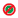

= La fenêtre exécutions
:allow-uri-read: 
:icons: font
:imagesdir: ../media/

[role="lead"]
La fenêtre exécutions affiche l'état du processus d'exécution pour chaque flux de travail soumis pour exécution. La fenêtre vous permet d'afficher les détails du processus d'exécution et de contrôler l'exécution d'un flux de travail. Vous pouvez accéder à cette fenêtre en sélectionnant *exécution* > *exécutions*.

* Table de flux de travail
* Barre d'outils

== Table de flux de travail

Le tableau Workflow répertorie les flux de travail soumis pour exécution. Vous pouvez personnaliser l'affichage du tableau à l'aide des fonctions de filtrage et de tri disponibles pour chaque colonne, ainsi qu'en réorganisant l'ordre des colonnes.

* image:../media/filter_icon_wfa.gif["Icône de filtre"] active ou désactive le filtrage pour l'ensemble de la table. Un "x" rouge apparaît sur l'icône si le filtrage est désactivé.
* Double-cliquer image:../media/filter_icon_wfa.gif["Icône de filtre"] efface et réinitialise les sélections de filtrage.
* image:../media/wfa_filter_icon.gif["Icône de filtre"] sur chaque en-tête de colonne, vous pouvez effectuer un filtrage en fonction du contenu des colonnes. Cliquez sur image:../media/wfa_filter_icon.gif["Icône de filtre"] dans une colonne, vous pouvez filtrer un élément spécifique dans la liste déroulante ou sur tous les éléments disponibles.
* Cliquer sur l'en-tête de colonne permet de basculer entre l'ordre croissant et décroissant de tri. Vous pouvez identifier l'ordre de tri appliqué à l'aide des flèches de tri (image:../media/wfa_sortarrow_up_icon.gif["Icône de tri"] pour les valeurs ascendantes et image:../media/wfa_sortarrow_down_icon.gif["Icône de tri"] pour décroissant).
* Pour réorganiser l'emplacement des colonnes, vous pouvez faire glisser et déposer les colonnes dans l'ordre voulu. Toutefois, vous ne pouvez pas masquer ou supprimer ces colonnes.
* Cliquez sur la zone de texte filtre *Search* pour rechercher un contenu spécifique. En outre, vous pouvez effectuer une recherche à l'aide des opérateurs pris en charge pour le type de colonne applicable, alphabétique ou numérique.

Le tableau suivant présente les opérateurs pris en charge pour les colonnes alphabétiques et numériques dans le tableau flux de travail, disponible dans la zone de texte filtre *Search*.

[cols="2*"]
|===
| Alphabétique | Valeur numérique 

 a| 
* Contient
* Ne contient pas
* Commence par
* Se termine par
* Égal à
* N'est pas égal
* Réinitialiser

 a| 
* Égal à
* N'est pas égal
* Inférieur à
* Supérieur à
* Inférieur ou égal à
* Supérieur ou égal à
* Entre
* Réinitialiser

|===
Le tableau Workflow contient les colonnes suivantes :

* *Numéro de travail*
+
Affiche le numéro d'identification du travail.

+
Le numéro d'identification du travail est unique et est attribué par le serveur lorsqu'il démarre le travail.

* *Nom*
+
Affiche le nom du flux de travail.

* *Heure de début*
+
Affiche la date et l'heure de démarrage du flux de travail.

+
Cliquez sur l'icône de calendrier dans la zone de texte filtre de recherche pour rechercher des workflows avec une date de début spécifique.

* *Heure de fin*
+
Affiche la date et l'heure de fin du flux de travail.

+
Cliquez sur l'icône de calendrier dans la zone de texte filtre de recherche pour rechercher des workflows avec une date de fin spécifique.

* *Statut*
+
Affiche l'état d'exécution du travail. La liste ci-dessous répertorie les différents États de haute disponibilité :

+
** Échec
+
Indique que le flux de travail a échoué pendant l'exécution. En fonction du temps écoulé depuis l'exécution du flux de travail, vous pouvez reprendre le flux de travail à partir de la commande FAILED.

** Exécution
+
Indique que le flux de travail est en cours d'exécution. Le flux de travail exécute le plan qui a été créé pendant la phase de planification, qui précède toute autre exécution.

** Réussi
+
Indique que le flux de travail a été exécuté avec succès.

** Annulée
+
Indique que le flux de travail a été annulé par un utilisateur.

** En attente d'approbation
+
Indique qu'un point d'approbation fait partie du flux de travail. Le flux de travail reste dans cet état jusqu'à ce que l'utilisateur spécifié approuve l'exécution du flux de travail.

** Planifié
+
Indique que la planification du flux de travail est terminée et que son exécution est planifiée.

** Abandon
+
Indique que le flux de travail est en cours d'abandon. Un flux de travail abandonné ne se poursuit pas avec l'exécution ; toute partie précédemment terminée du flux de travail reste terminée.

** Obsolète
+
Indique que le flux de travail planifié n'a pas été exécuté dans l'heure spécifiée selon le planning.

** Planification
+
Indique la résolution de la conception du flux de travail, l'emplacement de toutes les ressources, la vérification de la viabilité de la conception et la formulation du plan d'exécution. La planification peut être une action autonome, une partie de la vérification de conception ou une partie de l'exécution car chaque exécution commence par une nouvelle planification.

** En attente
+
Indique que le flux de travail se trouve dans la file d'attente de planification. Il s'agit d'un état interne. Le flux de travail est récupéré pour la planification à partir de cet état.

** Réussite partielle
+
Indique que même si le flux de travail a été exécuté avec succès, une ou plusieurs étapes ont échoué. L'exécution est terminée car les étapes ayant échoué ont été configurées de sorte que l'exécution du flux de travail se poursuit même lorsque l'étape a échoué.

* * Terminé*
+
Affiche le nombre d'étapes terminées du nombre total d'étapes pour le flux de travail sélectionné.

* *Soumis par*
+
Affiche le nom d'utilisateur de l'utilisateur qui a soumis le flux de travail.

* *Soumis au*
+
Affiche la date et l'heure auxquelles le flux de travail a été soumis.

+
Cliquez sur l'icône de calendrier dans la zone de texte filtre de recherche pour rechercher des workflows avec un certain envoi à la date.

* *Commentaire d'exécution*
+
Affiche le commentaire spécifié pour l'exécution du flux de travail.

* *Prévu pour*
+
Affiche la date et l'heure planifiées pour l'exécution du flux de travail.

+
Cliquez sur l'icône de calendrier dans la zone de texte filtre de recherche pour rechercher des flux de travail dont la date est prévue. Lorsqu'un filtre pour afficher les travaux à une date ultérieure est appliqué sur la colonne, les travaux dont la valeur est « Job # zéro » peuvent être affichés. Cela indique que le travail n'est pas encore créé et qu'il sera créé à l'heure programmée.

* *ID récurrent*
+
Affiche l'identifiant de la planification récurrente.

* *Nom de l'annexe*
+
Affiche le nom du planning.

* *Dernier changement d'état*
+
Affiche l'heure à laquelle un état a été modifié.

+
Cliquez sur l'icône de calendrier dans la zone de texte filtre de recherche pour rechercher des workflows avec une date de changement d'état de dernier spécifique.

* *Commentaire du point d'approbation*
+
Indique le message affiché à l'utilisateur au dernier point d'approbation, le cas échéant, pendant l'exécution du flux de travail.

== Barre d'outils

La barre d'outils se trouve au-dessus de l'en-tête de colonne. Vous pouvez utiliser les icônes de la barre d'outils pour effectuer diverses actions. Vous pouvez également accéder à ces actions à partir du menu contextuel de la fenêtre.

* *image:../media/details_wfa_icon.gif["Icône Détails"] (Détails)*
+
Ouvre la fenêtre surveillance du flux de travail sélectionné, qui contient les onglets suivants pour obtenir des informations détaillées sur le flux de travail :

+
** Débit
** Plan d'exécution
** Entrées utilisateur
** Paramètres de retour
** Historique

Vous pouvez également double-cliquer sur une entrée du tableau pour ouvrir la fenêtre surveillance afin d'afficher des informations détaillées.

* * (Abandon)*
+
Arrête le processus d'exécution de continuer. Cette option est activée pour les flux de travail en mode d'exécution.

* *image:../media/reschedule_wfa_icon.gif["Icône Réchechule"] (Replanifier)*
+
Ouvre une boîte de dialogue replanifier le workflow, qui permet de modifier l'heure d'exécution du flux de travail. L'option est activée pour les flux de travail qui sont à l'état planifié.

* *image:../media/resume_wfa_icon.gif["Icône reprendre"] (Reprise)*
+
Ouvre une boîte de dialogue reprendre le flux de travail qui vous permet de reprendre l'exécution du flux de travail après la modification des problèmes d'environnement (par exemple, des informations d'identification incorrectes sur une baie, des licences manquantes ou une baie en panne). L'option est activée pour les flux de travail qui se trouvent dans le `Failed` état.

* *image:../media/approve_resume_wfa_icon.gif["Icône approuver et reprendre"] (Approuver et reprendre)*
+
Vous permet d'approuver l'exécution du flux de travail et de poursuivre le processus d'exécution. Cette option est activée pour les flux de travail qui se trouvent dans le `Waiting For Approval state`.

* *image:../media/reject_abort_wfa_icon.gif["Icône rejeter et abandonner"] (Rejet et abandon)*
+
Vous permet de rejeter l'exécution du flux de travail et d'arrêter le processus d'exécution. Cette option est activée pour les flux de travail qui se trouvent dans le `Waiting For Approval state`.

* *image:../media/clean_reservation_wfa_icon.gif["Icône de nettoyage de la réservation"] (Réservation propre)*
+
Permet de nettoyer la réservation de ressources effectuée pour un workflow à partir du cache local. La réservation propre n'est disponible que pour les flux de travail planifiés, en échec et partiellement réussis. Vous ne pouvez pas reprendre la réservation après son nettoyage.

* *image:../media/refresh_wfa_icon.gif["Icône Réfrech"] (Actualiser)*
+
Actualise la liste des flux de travail. La vue est automatiquement actualisée. Vous pouvez activer ou désactiver l'actualisation automatique en cliquant sur image:../media/refresh_icon_wfa.gif[""] dans la barre d'état.

