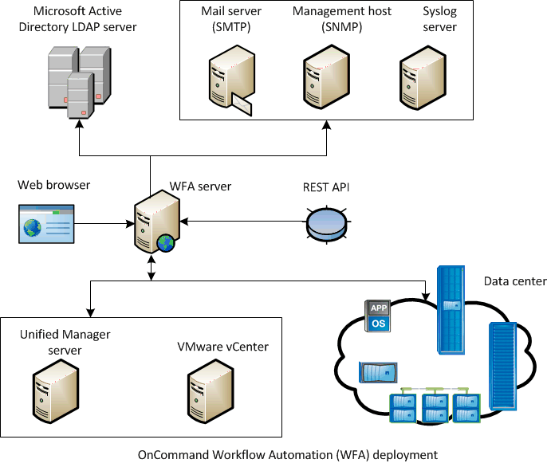

= Architecture de déploiement de OnCommand Workflow Automation
:allow-uri-read: 
:icons: font
:imagesdir: ../media/

[role="lead"]
Un serveur OnCommand Workflow Automation (WFA) est installé pour orchestrer les opérations de flux de travail dans plusieurs data centers.

Vous pouvez gérer votre environnement d'automatisation de manière centralisée en connectant votre serveur WFA à plusieurs déploiements Active IQ Unified Manager et VMware vCenters.

L'illustration suivante présente un exemple de déploiement :

