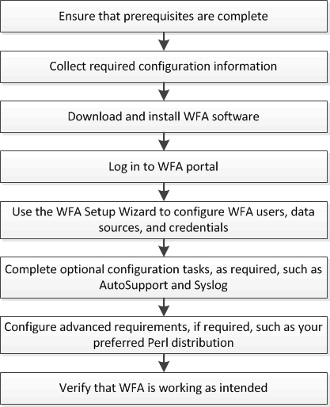

= Présentation de l'installation et de la configuration de OnCommand Workflow Automation
:allow-uri-read: 
:icons: font
:imagesdir: ../media/

[role="lead"]
L'installation de OnCommand Workflow Automation (WFA) inclut l'exécution de tâches telles que la préparation de l'installation, le téléchargement du programme d'installation WFA et l'exécution du programme d'installation. Une fois l'installation terminée, vous pouvez configurer WFA pour qu'il réponde à vos exigences.

L'organigramme suivant illustre les tâches d'installation et de configuration :

