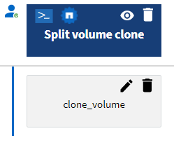

= Quels sont les points d'approbation
:allow-uri-read: 
:icons: font
:imagesdir: ../media/

[role="lead"]
Les points d'approbation sont des points de contrôle utilisés dans un flux de travail pour interrompre l'exécution du flux de travail et le reprendre en fonction d'une approbation de l'utilisateur.

La barre verticale bleue illustrée dans l'illustration suivante est un point d'approbation :

Vous pouvez utiliser des points d'approbation pour l'exécution incrémentielle d'un flux de travail, où les sections du flux de travail doivent être exécutées uniquement après qu'une condition donnée est remplie. Par exemple, lorsque la section suivante doit être approuvée ou lorsque l'exécution de la première section est validée. Les points d'approbation ne gèrent aucun processus entre la pause et la reprise d'un flux de travail. Des notifications par e-mail et SNMP sont envoyées, comme spécifié dans la configuration WFA, et l'opérateur du stockage peut être invité à effectuer certaines actions après réception de la notification de pause du workflow. Par exemple, l'opérateur du stockage peut envoyer des informations de planification à l'administrateur, à l'approbateur ou à l'opérateur pour approbation et reprendre le workflow dès réception de l'approbation.

Il est possible qu'aucune approbation ne soit requise à tout moment. Dans certains cas, l'approbation peut être nécessaire uniquement si une condition particulière est remplie et que les conditions peuvent être configurées lors de l'ajout d'un point d'approbation. Prenons l'exemple d'un workflow conçu pour augmenter la taille d'un volume. Vous pouvez ajouter un point d'approbation au début du flux de travail pour que l'opérateur de stockage obtienne l'approbation des responsables lorsque l'augmentation de la taille du volume entraîne une utilisation à 85 % de l'espace dans l'agrégat contenant le volume. Lors de l'exécution du flux de travail et lors de la sélection d'un volume entraînant cette condition, l'exécution est arrêtée jusqu'à ce qu'elle soit approuvée.

La condition configurée pour le point d'approbation peut avoir l'une des options suivantes :

* Sans aucune condition
* Lorsque la variable que vous avez spécifiée est trouvée
* Lorsque la variable que vous avez spécifiée est introuvable
* Lorsque l'expression que vous avez spécifiée est vraie

Le nombre de points d'approbation dans un flux de travail n'est pas limité. Vous pouvez insérer des points d'approbation avant les commandes dans un flux de travail et définir les commandes après le point d'approbation pour attendre l'approbation avant l'exécution. Les points d'approbation fournissent des informations, telles que l'heure de modification, l'utilisateur et les commentaires, vous permettant de voir quand et pourquoi l'exécution du flux de travail a été interrompue ou reprise. Les commentaires de point d'approbation peuvent inclure des expressions MVEL.

== Exemples de points d'approbation dans les flux de travail prédéfinis

Vous pouvez ouvrir les flux de travail prédéfinis suivants dans le concepteur pour comprendre comment les points d'approbation sont utilisés :

* Supprimer un volume clustered Data ONTAP
* Mise à niveau du contrôleur et du tiroir d'une paire haute disponibilité
* Migrer des volumes

