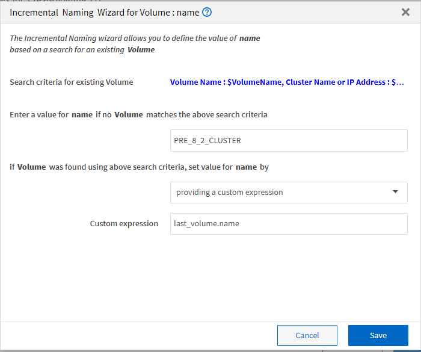

= La définition d'une attribution de nom incrémentielle
:allow-uri-read: 
:icons: font
:imagesdir: ../media/

[role="lead"]
La dénomination incrémentielle est un algorithme qui vous permet de nommer les attributs d'un workflow en fonction des résultats de la recherche d'un paramètre. Vous pouvez nommer les attributs en fonction d'une valeur incrémentielle ou d'une expression personnalisée. La fonctionnalité de nommage incrémentielle vous permet de mettre en œuvre une convention de nommage basée sur vos besoins.

Vous pouvez utiliser la fonctionnalité de dénomination incrémentielle lors de la conception de flux de travail pour nommer dynamiquement les objets créés par le flux de travail. La fonctionnalité vous permet de spécifier des critères de recherche pour un objet à l'aide de la fonction de sélection de ressources et la valeur renvoyée par les critères de recherche est utilisée pour l'attribut de l'objet. En outre, vous pouvez spécifier une valeur pour l'attribut si aucun objet n'a été trouvé avec les critères de recherche spécifiés.

Vous pouvez utiliser l'une des options suivantes pour nommer les attributs :

* Fournit une valeur d'incrément et un suffixe
+
Vous pouvez fournir une valeur qui doit être utilisée avec la valeur de l'objet trouvée par les critères de recherche et incrémenter avec le numéro que vous spécifiez. Par exemple, pour créer des volumes avec la convention de nommage des `filer name_unique number_environment,` vous pouvez utiliser un finder pour trouver le dernier volume par son préfixe de nom et incrémenter le numéro unique par 1, ainsi que pour ajouter le nom du suffixe au nom du volume. Si le dernier préfixe de nom de volume trouvé était _vf_023_ _ prod et que vous créez trois volumes, les noms des volumes créés sont _vf_024_prod, vf_025_prod et vf_026__ prod.

* Fourniture d'une expression personnalisée
+
Vous pouvez fournir une valeur qui doit être utilisée avec la valeur de l'objet trouvée par les critères de recherche et ajouter des valeurs supplémentaires basées sur l'expression que vous entrez. Par exemple, pour créer un volume avec la convention de nommage des `last volume name_environment name padded with 1,` vous pouvez entrer l'expression `last_volume.name + '_' + nextName("lab1")`. Si le nom du dernier volume trouvé était vf_023_, le nom du volume créé est _vf_023_lab2_.

L'illustration suivante montre comment fournir une expression personnalisée pour spécifier une convention de dénomination :

